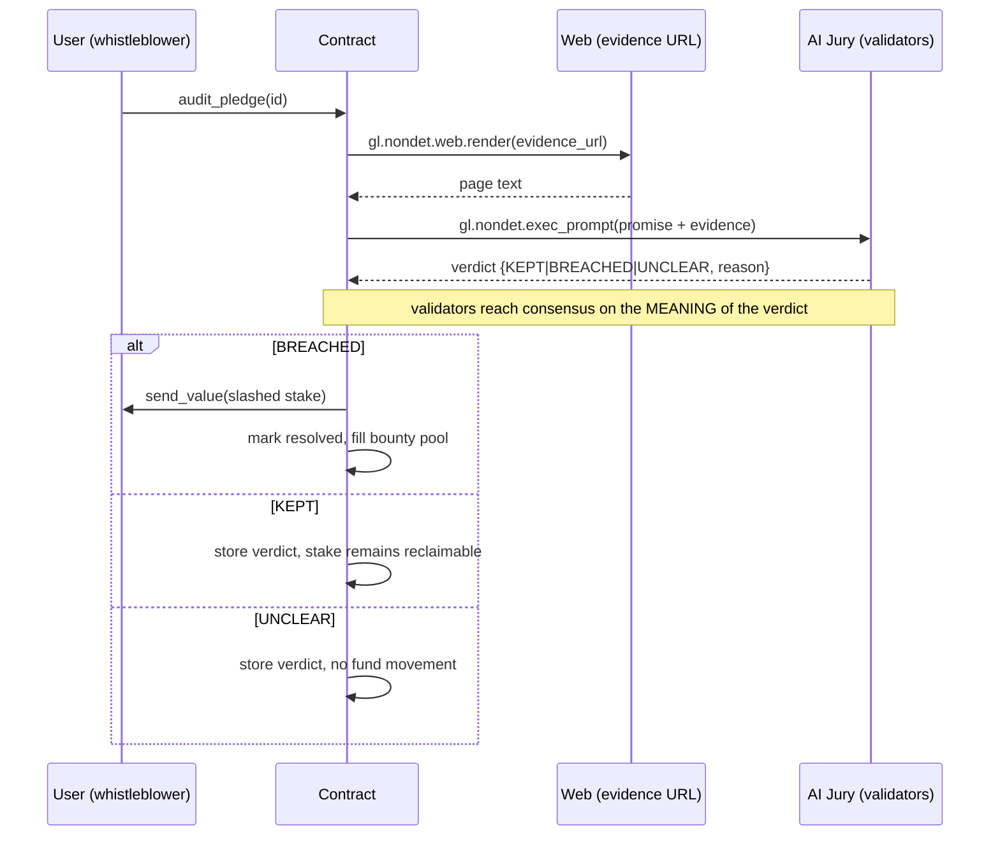

# Architecture

## Components

- **`contracts/pledge_auditor.py`** — the Intelligent Contract. Holds pledge
  state, runs the non-deterministic audit, and applies deterministic effects
  (slash / reclaim / state transitions).
- **`frontend/`** — a genlayer-js dApp that signs transactions and reads state.
- **`scripts/`** — deploy + seed utilities.

## Audit sequence

## Consensus design (Trục 2 — content, not shape)

The `validator_fn` rejects any leader result that is not a valid `gl.vm.Return`
or whose verdict is not one of the three allowed conclusions. The goal is that
validators agree on the **decision** (KEPT/BREACHED/UNCLEAR), not merely that
the JSON has the right keys. Two validators that produce well-formed JSON but
different verdicts must not both pass.

## Non-determinism boundary

All web/LLM access lives inside `leader_fn` / `validator_fn` passed to
`gl.vm.run_nondet_unsafe`. The deterministic section only parses the agreed
result and moves funds. Storage is never read or written from inside the
non-deterministic block.

## Edge cases handled

- Dead / unreachable evidence URL → `UNCLEAR`, no slash.
- Unparseable LLM output → `UNCLEAR`, no slash.
- Double resolution → `resolved` flag blocks re-audit after a breach.
- Non-creator reclaim → rejected.
- Reclaim before a KEPT verdict → rejected.
- Duplicate pledge id / empty promise / non-http URL → rejected at registration.
